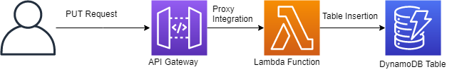

## chalice-lambda-dynamodb-example
This is an example of using Python and [Chalice](https://github.com/aws/chalice) to run an AWS Lambda function behind an AWS API gateway. The Lambda function has access to write to a DynamoDB table.

## Setup
1. Install Python 3.6.X: https://www.python.org/downloads/release/python-369/
  - Chalice supports all versions of Python that AWS Lambda supports (2.7 and 3.6).
2. Install the AWS CLI: https://aws.amazon.com/cli/
3. Configure the AWS CLI with an IAM user that has programmatic access enabled by running `aws configure`. The user should have permissions to create API Gateways, IAM roles, and Lambda functions in the region you have configured.
4. Install Chalice and Boto3: `python -m pip install chalice && python -m pip install boto3`
  - Depending on your operating system and how you installed Python 3, you may need to do some additional work to set up pip. (e.g. on CentOS `yum install -y python-pip`).
5. Run `chalice deploy`
  - Again, depending on how you installed Python, you may need to add the Python `Scripts` folder to your `PATH` environment variable. You can also try `python -m chalice`
6. Open the IAM service in the AWS Console and go to Roles. Attach the `AmazonDynamoDBFullAccess` policy to the `lambda-dyanmodb-example-dev` role created by Chalice.
7. Create a DynamoDB table using CloudFormation by running `make table` or `aws cloudformation deploy --template-file resources.json --stack-name devices-table`
8. Get the name of the table by running `make table-info` or `aws dynamodb describe-table --table-name $(aws cloudformation describe-stacks --query "Stacks[0].Outputs[?OutputKey=='DevicesTableName'].OutputValue" --output text)`
9. Replace the `table_name` variable in app.py with the output from the previous step. 
10. Invoke the function using cURL or your preferred http client: `curl -X PUT https://<YOUR_API_GATEWAY_ID>.execute-api.<YOUR_REGION>.amazonaws.com/api/insert -H "Content-Type:application/json" -d @event.json`

For more information on how to configure the deployment (Lambda functions's compute specifications, tagging, roles, environment variables) see https://chalice.readthedocs.io/en/latest/topics/configfile.html.

Have a question or need some help? Open an [Issue](https://github.com/swoldemi/chalice-lambda-dynamodb-example/issue).